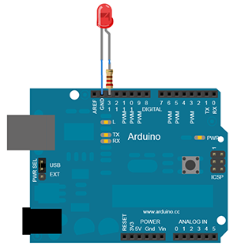

tweet-alert
===========

A simple Arduino/NodeJS installation who triggers something when somebody tweets. e.g. flashing a led, etc...

Uses [Johnny-five](https://github.com/rwaldron/johnny-five) & [user-stream](https://github.com/aivis/user-stream) for Twitter streaming API.

## INSTALL

```shell
$ git clone git@github.com:raiseandfall/tweet-alert.git && cd tweet-alert
$ npm install
```

## BASIC EXAMPLE

This example flashes a LED every 250ms for 15s when a specific user has tweeted.

#### Arduino


#### JS

```javascript
var TweetAlert = require('./src/tweet-alert'),
    five = require('johnny-five'),
    app,
    board = new five.Board(),
    led;

// Init
app = new TweetAlert({
  consumer_key: 'xxxxxxxxxxxxxxxx',
  consumer_secret: 'xxxxxxxxxxxxxxxx',
  access_token_key: 'xxxxxxxxxxxxxxxx',
  access_token_secret: 'xxxxxxxxxxxxxxxx',
  screen_name: ['kexp', 'rue89']
});

// Wait for the board to be ready
board.on('ready', function() {
  led = new five.Led(13);
  led.off();

  // Start to track
  app.track();

  // Listen to tweet alert
  app.on('tweet', function(data) {
    console.log('New Tweet :: ', data.text, ' by ', data.user);

    led.strobe(250);
    setTimeout(function() {
    	led.off();
    }, 15000);
  });
});
```

## TWEET READER EXAMPLE

[Source code](https://github.com/raiseandfall/tweet-alert/blob/master/example.js).


## CONTRIBUTE

```shell
# Start nodemon
$ gulp dev

# Build sources
$ gulp build
```

## API

#### Configuration
- ```consumer_key``` - `String` - Twitter app consumer key
- ```consumer_secret``` - `String` - Twitter app consumer secret
- ```access_token_key``` - `String` - Twitter app access token key
- ```access_token_secret``` - `String` - Twitter app access tokensecret
- ```screen_name``` - `String|Array` - Twitter screen name(s) to filter. Can be an empty string (all the users followed = your entire Twitter feed), one user or an array of users.

#### Methods
- ```track``` - starts tracking Twitter account
- ```untrack``` - stops tracking; closes Twitter stream

#### Events
- ```tweet``` - fired when new tweet streamed. Sends back a data object :
```javascript
{
    text: 'Tweet',
    screen_name: 'screen_name',
    name: 'Firstname Lastname',
    id: '123456'
}
```

- ```close``` - fired when Twitter Stream connection has closed
- ```error``` - fired when error has occured


## License
MIT
